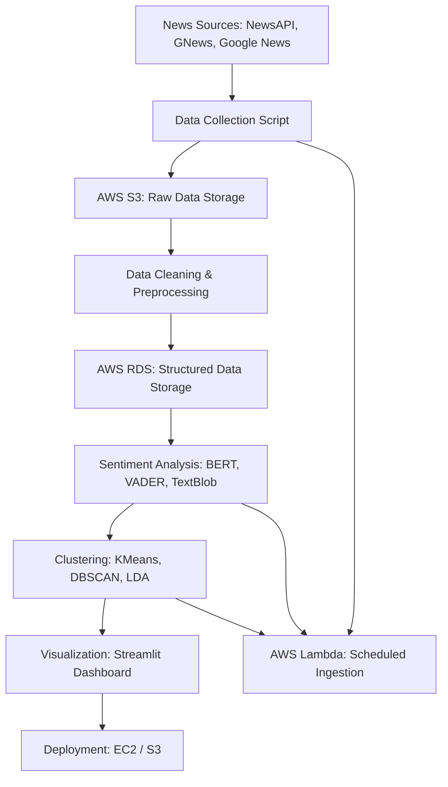

# 📊 Senticonomy: News Sentiment Analysis and Economic Impact Visualization

**An end-to-end pipeline to analyze real-time and historical news for economic and public sentiment tracking.**

---

## 🧠 Project Overview
Senticonomy is a data analytics pipeline and visualization tool that collects, processes, analyzes, and visualizes news data from multiple sources to derive sentiment insights across categories such as Business, Politics, Tech, and more. These insights can be used to gauge economic trends, monitor public mood, and analyze media narratives.

---

## 🎯 Objectives
- Analyze historical and real-time news data for sentiment trends
- Enable financial forecasting and policy impact monitoring through sentiment insights
- Provide an interactive dashboard for business and public use
- Automate daily news ingestion, processing, and visualization

---

## 🔬 Scope
**In Scope:**
- News collection via APIs
- Sentiment analysis using NLP models
- Clustering of news articles
- Dashboard development with daily automation

**Out of Scope:**
- Multilingual NLP
- Real-time alert systems
- User authentication systems

---

## 🔀 Pipeline Overview

---

## 💡 Key Features
- **Multi-source ingestion**: Collects data from multiple news APIs
- **Modular Preprocessing**: Tokenization, lemmatization, stopwords removal
- **Hybrid Sentiment Models**: BERT for accuracy, VADER/TextBlob for speed
- **Clustering**: Groups similar articles and discovers emerging topics
- **Interactive Visualization**: Streamlit web app with category/topic filters
- **Cloud Automation**: AWS Lambda for hands-free updates

---

## 🛠️ Technologies & Tools
| Category | Tech |
|---------|------|
| Language | Python |
| NLP | NLTK, SpaCy, BERT, TextBlob, VADER |
| Data Collection | NewsAPI, GNews, Google News |
| Data Storage | AWS S3, AWS RDS |
| Visualization | Plotly, Matplotlib, Streamlit |
| Automation | AWS Lambda, EC2 |
| Version Control | Git, GitHub |

---

## 📈 Project Metrics
| Metric | Description |
|--------|-------------|
| Data Quality | Completeness, Deduplication, Null Checks |
| Sentiment Accuracy | Precision/Recall of classification models |
| Clustering Effectiveness | Silhouette Score, Topic Coherence |
| Web App Usability | Load Time, Interaction Smoothness |
| Automation Efficiency | Lambda success rate, processing time |

---

## 📂 Dataset Info
- **Sources**: NewsAPI, GNews, Google News, Kaggle
- **Format**: JSON, CSV
- **Fields**: `Headline`, `Content`, `Date`, `Source`, `Category`, `Sentiment Score`
- **Processing**: Text normalization, cleaning, enrichment

---

## 📦 Deliverables
- ✅ Modular Python Scripts (Data Collection → Analysis)
- ✅ AWS Setup for S3, RDS, Lambda
- ✅ Preprocessed Dataset
- ✅ Streamlit Web Application
- ✅ README + API Documentation

---

## 📜 Guidelines
- Follow modular coding with reusable functions/classes
- Commit regularly with meaningful messages
- Use `.env` for managing API keys securely
- Include logging and exception handling in all scripts
- Optimize for cost-efficiency on AWS

---

## 🔖 Technical Tags
`#NLP` `#SentimentAnalysis` `#AWS` `#Python` `#APIs` `#Clustering` `#NewsAnalytics` `#Streamlit` `#DataVisualization`

---

## 🤝 Business Use Cases
- **Financial Market Prediction**
- **Public Sentiment Tracking**
- **Brand & Media Monitoring**
- **Policy Impact Assessment**

---

> _“Sentiment is the soul of society. Senticonomy gives it a voice, a shape, and a dashboard.”_

---

**Author**: Santhosh Kumar  
**Contact**: [Your GitHub Profile or Email]  
**License**: MIT / Apache 2.0 (Choose accordingly)
